 # Portfolio 1 - Mark's Maintenance Killarney README

## 1. Purpose of the Project

Mark's Maintenance Killarney is a service provider website aimed at people in need of property and garden maintenance services. The site aims to provide information on the services provided categorised into broad overaching fields of competence and further broken down to specific services. It also edeavours to encourage potential interested persons to contact the service provider if they feel they have a particular need that may well fall within these areas of competence but are not speciffically listed. Furthermore the site endeavours to convey to potential customers of the business a sense of experience and competence through the use of both testimonials and examples of work via the photo gallery. Finally it provides interested persons with several means of contacting the service provider.

From the business owner's point of view the clear aim is to increase business volume by providing clear information on the services the business provides, ensuring this information gets to the right people through thoughtful Search Engine Optimisation and providing clear and easy means of contacting the business.

This site is aimed at people likely to be searching for services and terms such as, Handyman, Handyperson, DIY, Propery Maintenance, Garden Maintenance, Grass Cutting, No Job too Small.

## 2. User Stories

The user stories upon which the features of the project are based are as follows:

1. As a visiting user, I want to be able to navigate this site easily.

2. As a visiting user, I want to know what services are provided by this business so that I can quickly determine if it may be able to meet my needs.

3. As a visiting user, I want to know if the business has a track record of providing these services.

4. As a visiting user, I would like to see some examples of previous work the business has done.

5. As a visiting user, I want to know how to contact the business if I have a query or if I think it can provide the service I need.

## 3. Features

### 3.1 Navigation

* The navigation bar is horizontal, located at the top of the page and is fixed. 

* The navigation bar contains the company logo on the left side and this is also a link to the top of the page.

* The navigation bar contains four links to sections of the page. These are Home, Testimonials, Gallery and Contact Us.

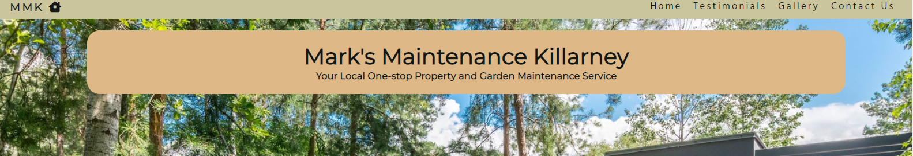

### 3.2 Header

* The header contains an hero image of a house and garden in keeping with the purpose of the site.

* The business name "Mark's Maintenance Killarney" features prominently at the top. Also included is the sub-heading "Your Local One-stop Garden and Property Maintenance Service".

* The header also contains a seperate highlighted tag line of "As Life's Too Short for DIY!"

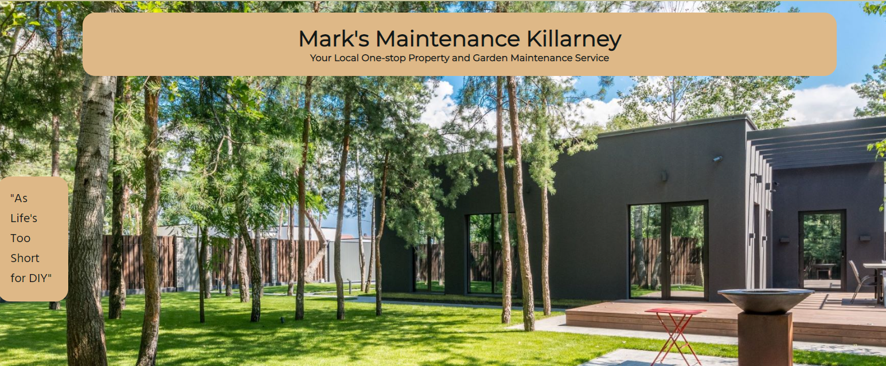

### 3.3 What we do

* Contains four distinct sections, one for each of the four areas of business competency, these being GARDEN, FLAT-PACK ASSEMBLY, PRESSURE WASHING AND CLEANING and INTERIOR PAINTING AND DECORATING.

* Each section contains a paragraph oulining the services provided.

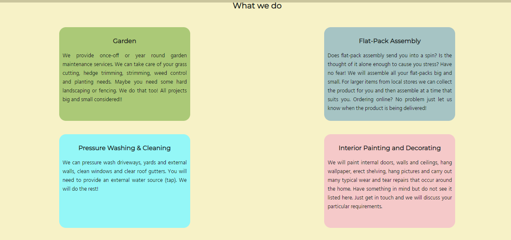

### 3.4 Testimonials

* Four testimonials are provided, two from women and two from men.

* Each testimonial relates to a different area of competence.

* Each is presented on a seperate card.

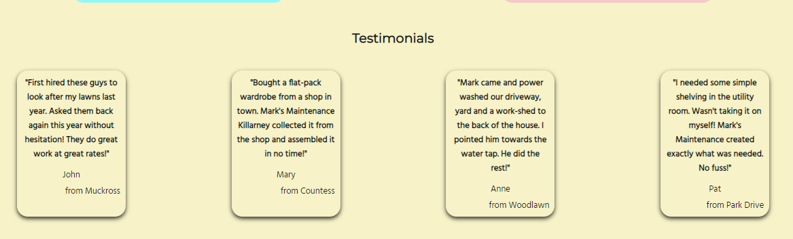

### 3.5 Gallery

* The gallery provides examples of work in each of the four main areas of competence.

* Each photograph has a short discription beneath it.

* Each photogragh when clicked on, opens up a larger version of itself in a new page.

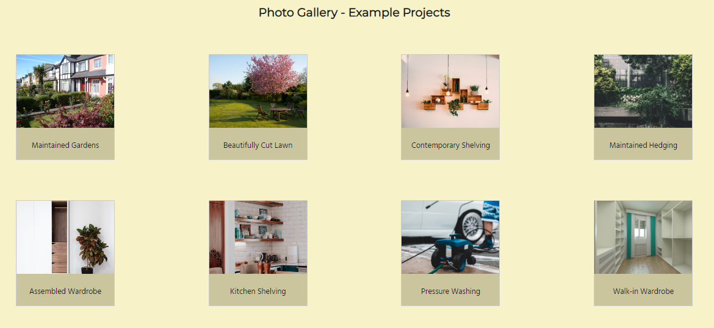

### 3.6 Contact Us

* Contains contact details including, telephone number, email address and address.

* Includes a contact form that can be completed and submitted. The form has required fields so as to ensure correct completion. Upon submission a comfirmation page is returned.

* A google map is included in versions for larger screens as an additional aid. It is excluded from smaller screen versions as it was not a specific project requirement and takes up space without absolute necessity.

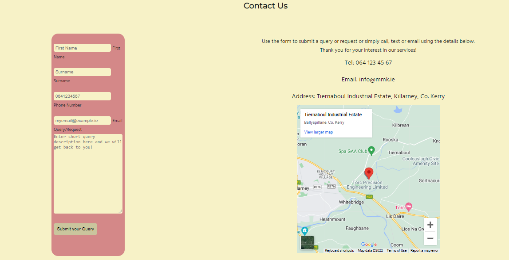

### 3.7 Footer

* The footer is clean and simple only containing links to social media.

* Links are provided to Facebook, Instagram, Twitter and youtube via their social media icons.

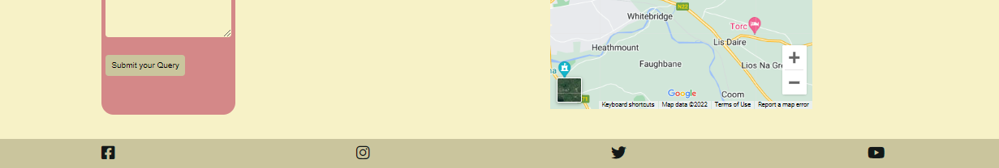

## 4. Future Features

Two potential future features have been identified at this point as follows:

1. Provision of a Business to Business (B2B) section is a likely short term add on goal. It would be reasonably straight forward to add this on as the service offering would be the same. The B2B section would focus more on additional information that business might require such as VAT registration, VAT number, Tax Clearance Status, Insurances etc. It could also provide addition specification detail regarding certain services. For example a larger business may require more detail on the type of equipment the business holds. For cutting lawns does the business have a ride-on with a large cutting capacity or a smaller capacity walk behind mower? This could be important to a property management company for example. Also a B2B section could suggest possible business link ups. For example, "Are you a furniture store? Maybe you want to consider offering an assembly service directly to your customers? Talk to us!" While the addition of the B2B section is not technically difficult it does requie the provision of more detailed information all of which would need to be carefully reviewed for accuracy. Given the time that would be required it was considered more beneficial to the business' goal to launch the site without this initially and add it later.

2. A longer term goal might be the provision of pricing information. However given the relatively wide range of services provided this is a more difficult proposition. Factors such as equipment required for a given job, required total labour hours, distance to the job site etc. all form part of the calculation. Any future provision of such information would have to be very carefully considered by the business owners.

## 5. Typography and Color Scheme

### 5.1 Typography

* The chosen font for Headings is Montserrat.

* The chosen font for all other text is Hind.

* It is considered that together they convey the simple, clean, businesslike approach required for this website.

* The pairings were chosen from Google Fonts with reference to www.fontpair.co

### 5.2 Color Scheme

* The font-color is #131817 which is close to black and was chosen to ensure the text is easily read on lighter backgrounds.

* All other colors have been chosen to ensure clear contrast with the font-color.

* All other colors have been chosen to be in keeping with the overall theme of the site that being it is related to gardens, property, handyperson work or if the color is deemed to relate to a specific competency of the business.

* The background colour is #f7f2c7. It does not distract from the site content and aligns with the hero image.

* The background color for the header and footer is #cac59d and was chosen to provide a degree of contrast from the main body of the page without being radically different. The subtle difference is important particularly for the header which is fixed and would otherwise blend into the background at certain scroll locations.

* The background color for the link hover position is #8fbc8f and the font color is white (#ffffff). These were chosen to provide adequate contrast with each other and the pre-hover position.

* The background color for text on the hero image is #deb887. This was chosen to provide adequate contrast with the image but remains in keeping with the main background color.

* The background color for the garden section is #abc977. This is a green color in keeping with the gardening theme.

* The background color for the flat-pack assembly section is #a6c4c4, a light grey, thought to reflect a more functional, mechanical competence.

* The background color for the pressure washing and cleaning section is #94f7f7, a light blue color thought to reflect water and therefore appropriate to this section.

* The background color for the interior painting and decorating section is #f5c9c9, a warmer, calm color refecting the comfort gained from an interiors upgrade.

* The background color for the contact form is #d48888. This was chosen to provide adequate contrast and clearly define the form. It is similar to but darker than the interiors color and so stands out without being completely alien to the page.

* The hover color for the form imputs is white. This is considered to clearly indicate an input field to the user.

## 6. Wireframes

Based on the required features, wireframe outlines were produced and agreed. The development of the website then proceeded so as to realise these outlines. The wireframes are included hereunder for reference.

#### Image One

Outlines the top half of the webpage.

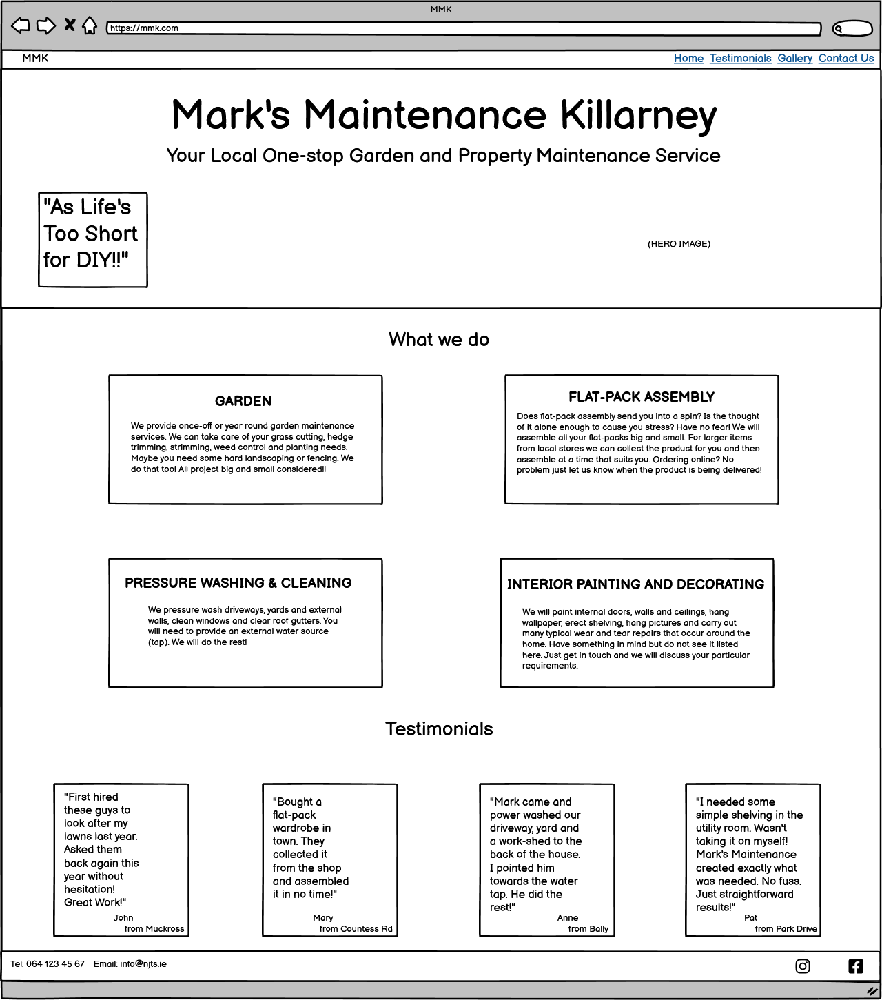

#### Image Two

Outlines the bottom half of the webpage.

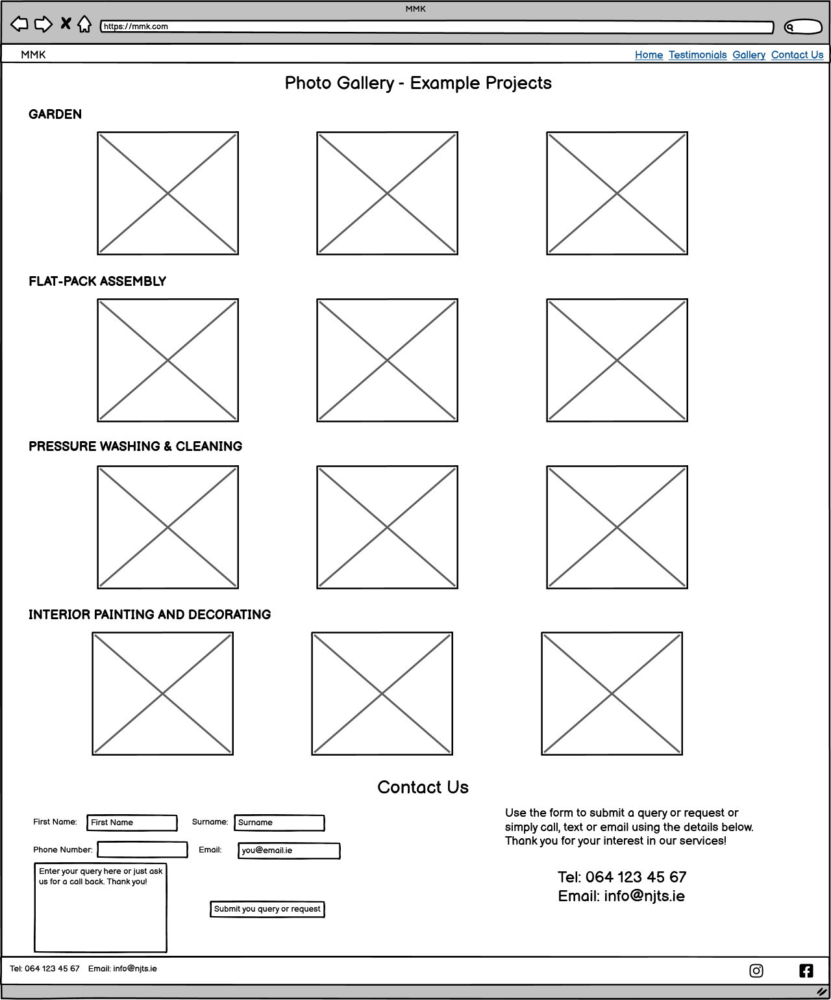

## 7. Technology

The following technologies were used:

* HTML

* CSS

* The IDE used was GITPOD

* The repoitory used is GITHUB

* The website is deployed on GITHUB pages.

* Testing was carried out using Chrome Developer Tools including lighthouse for responsiveness and performance.

* Balsamiq was used to prepare wireframes.

## 8. Testing

   ### 8.1 Code Validation

The code successfully passed html validation:

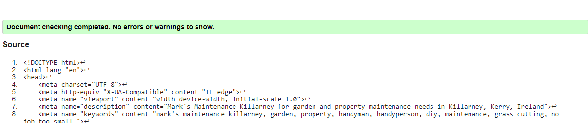

The code successfully passed css validation:

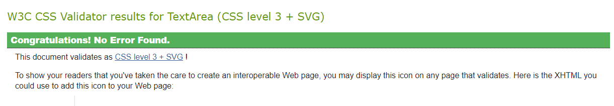

   ### 8.2 Test Cases

   #### 8.2.1 User Story 1

As a visiting user, I want to be able to navigate this site easily.

This requirement is met by provision of a navigation bar that has certain requirements tested as follows:

Test Requirement|Met Requirement when tested
---|:---:
Show company logo|Yes
Logo is a link to top of page and returns to top when clicked|Yes
Provide home link|Yes
Clicking home link returns to top of page|Yes
Provide Testimonials link| Yes
Clicking Testimonials link brings us to top of Testimonials|Yes
Provide Gallery link| Yes
Clicking Gallery link brings us to top of Gallery|Yes
Provide Contact Us link| Yes
Clicking Contact Us link brings us to top of Contact Us|Yes
Header is sticky so it can be accesed at any point| Yes

#### 8.2.2 User Story 2

As a visiting user, I want to know what services are provided by this business so that I can quickly determine if it may be able to meet my needs.

This requirement is met by provision of a What we do section that has certain requirements tested as follows:

Test Requirement|Met Requirement when tested
---|:---:
Provide information on services provided relating to the garden|Yes
Provide information on services provided relating to flat-pack assembly|Yes
Provide information on services provided relating to pressure washing and cleaning|Yes
Provide information on services provided relating to interior decorating and painting|Yes

#### 8.2.3 User Story 3

As a visiting user, I want to know if the business has a track record of providing these services.

This requirement is met by provision of a Testimonials section that has certain requirements tested as follows:

Test Requirement|Met Requirement when tested
---|:---:
Provide testimonals relating to various aspects of the service available|Yes

#### 8.2.4 User Story 4

As a visiting user, I would like to see some examples of previous work the business has done.

This requirement is met by provision of a photographic gallery section that has certain requirements tested as follows:

Test Requirement|Met Requirement when tested
---|:---:
Show photographs of a varied sample of works|Yes
Include captions under photographs to explain the particular work example|Yes
Have clickable photographs that open in a larger format in a new tab|Yes
Check each photogragh opens correctly when clicked|Yes

#### 8.2.5 User Story 5

As a visiting user, I want to know how to contact the business if I have a query or if I think it can provide the service I need.

This requirement is met by provision of a contact us section and social media links in the footer that have certain requirements tested as follows:

Test Requirement|Met Requirement when tested
---|:---:
Provide business phone number|Yes
Provide business email|Yes
Provide business address|Yes
Provide map on larger screen sizes|Yes
Provide a contact form|Yes
On Form:|
Provide a field for first name|Yes
Make first name a required field (form will not submit without entry - provides prompt)|Yes
Provide a field for surname|Yes
Make surname a required field (form will not submit without entry - provides prompt)|Yes
Provide a field for phone number|Yes
Make phone number a required field (form will not submit without entry - provides prompt)|Yes
Phone number field will only accept numbers to reduce error risk - provides prompt|Yes
Provide a field for email address|Yes
Make email address a required field (form will not submit without entry - provides prompt)|Yes
Email address field will only accept email address formats to reduce error risk - provides prompt|Yes
Provide a field for query entry - not a required field|Yes
Entry fields change color when mouse hovers over|Yes
Provide a submit button|Yes
Submit button changes color when hovered over|Yes
When submit pressed a confirmation pages opens|Yes
Confirmation page has header and footer in same website styling|Yes
Confirmation page has logo and home links for navigation back to main page|Yes
Confirmation page links work when clicked|Yes
Temporarily link form to Code Institute form dump via method POST and check data correctly sent|Yes (See screen grabs below)
Clicking on Facebook icon opens Facebook in a new page|Yes
Clicking on Instagram icon opens Instagram in a new page|Yes
Clicking on Twitter icon opens Twitter in a new page|Yes
Clicking on youtube icon opens youtube in a new page|Yes

#### 8.2.6 Form Dump Screen Grabs

Completed Form:

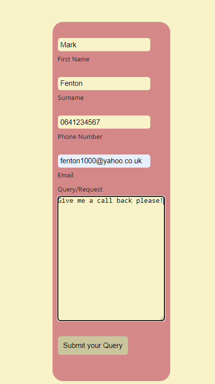

Form Dump Confirmation:

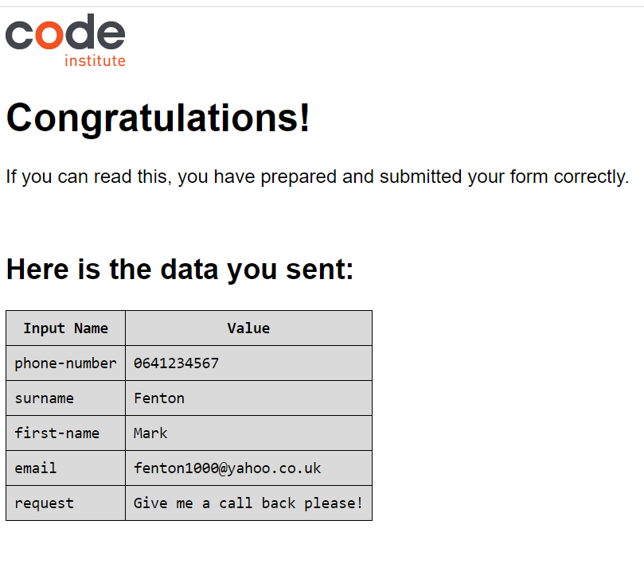

   ### 8.3 Fixed Bugs

1. At certain screen widths the navigation elements were not well aligned.

Solution: Reviewed, adjusted and added media queries to better control font-size, float and letter spacing at various screen widths. Also removed the font awesome icon from the logo at screen widths less than 340px to free up screen space. This was achieved by adding a span element to contain the icon in the index.html file and then targeting this span in an @media screen and (max-width: 340px) media query with a css rule display: none.

2. When deployed to Github the main heading sat too high on screens less than 700px and was partly covered by the header.

Solution: The simple solution was to adjust the absolute position of the main heading div element to top: 30px. This solved the issue for the relevant screen width range with other media queries already successfully governing positioning above and below this.

   ### 8.4 Supported Screens and Browsers

   #### 8.4.1 Supported Screens

The site has been tested and was found to be responsive and work for the following screen sizes using Chrome Developer Tools:

* Galaxy Fold

* Mobile 375px

* Mobile 425px

* Tablet 768px

* Laptop 1024px

* Laptop 1440px

* Screen 2225px

The Am I Responsive website generates the following screen examples:

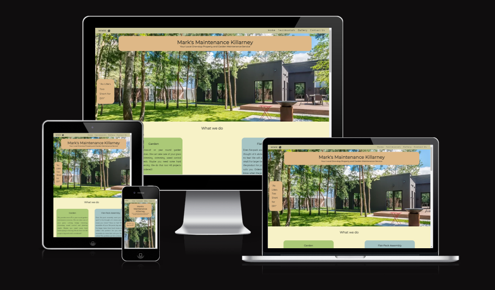

   #### 8.4.2 Supported Browsers

The site has been tested and was found to work on the following internet browsers:

* Google Chrome

* Microsoft Edge

## 9. Deployment
   ### 9.1 via gitpod
   ### 9.2 via github pages
## 10. credits

Photo gallery html structure from w3 schools see https://www.w3schools.com/css/css_image_gallery.asp

/* Photo gallery css styling from w3 schools
    see https://www.w3schools.com/css/css_image_gallery.asp  */

/* .card adds shadows to create the "card" effect for testimonials - credit to w3schools.com */
